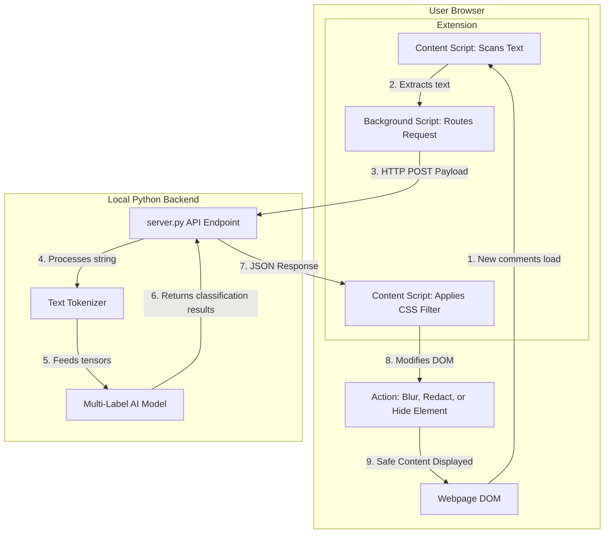
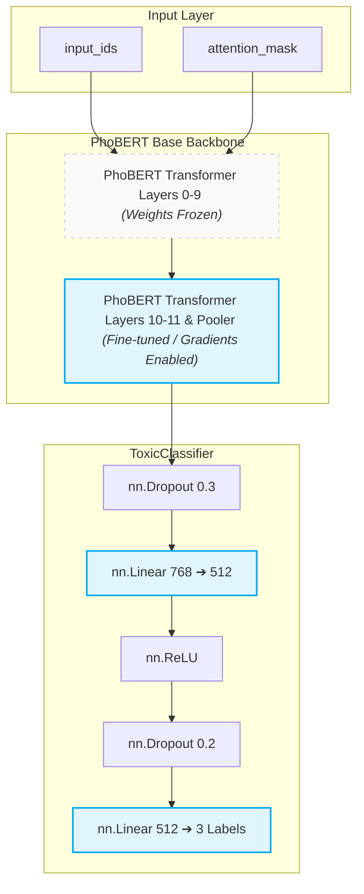

# 🛡️ Vietnamese Toxic Comment Censorship Extension

A  extension and local AI backend designed to create a safer browsing experience, especially for children. By utilizing a custom machine learning model trained for text classification, this tool evaluates web text in real-time and automatically censors harmful, toxic, or offensive comments before you read them. 

The project pairs a lightweight JavaScript frontend extension with a local Python inference server to process text efficiently without relying on external APIs.

## 📋 Table of Contents
- [Program Architecture](#architecture)
- [Program Architecture](#dataset)
- [Model Details & Performance](#model-details--performance)
- [Installation & Setup](#installation--setup)
  - [Backend Server Setup](#backend-server-setup)
  - [Extension Installation](#extension-installation)


## Program Architecture



## Dataset

To ensure the extension accurately understands the nuances of Vietnamese internet slang, context, and toxicity, the model was trained using the **ViHSD (Vietnamese Hate Speech Detection)** dataset. 

### Dataset Overview
Developed by the UIT Natural Language Processing Group, ViHSD is a large-scale, human-annotated corpus specifically designed for detecting harmful content on Vietnamese social media. 
* **Data Source:** Over 30,000 comments collected from real-world, highly active social platforms like Facebook and YouTube.
* **Categorization:** The dataset categorizes text into three core labels: `CLEAN`, `OFFENSIVE`, and `HATE`.

As is common with organic social media data, the ViHSD dataset is highly imbalanced—the vast majority of comments are `CLEAN`, while genuine `HATE` represents a smaller minority class. Training a multi-label classifier directly on imbalanced distributions often leads to poor minority class detection. To overcome this, the current training pipeline utilizes undersampling of the `CLEAN` class to achieve class balance. 


## 🧠 Model Details & Performance


###  Model Architecture 


The model leverages **PhoBERT-base**, a pre-trained language model specifically optimized for Vietnamese text (based on the RoBERTa architecture). To optimize training and preserve PhoBERT's foundational language understanding, the custom `ToxicClassifier` uses a targeted fine-tuning strategy:
* **Frozen Backbone (Layers 0-9):** The first 10 transformer layers are frozen. This reduces the computational resources needed for training while retaining the general language embeddings.
* **Fine-Tuned Layers (Layers 10, 11 & Pooler):** Only the deepest transformer layers are trained, allowing the model to adapt specifically to the toxicity classification task.
* **Custom Classification Head (ToxicClassifier):** This simple network uses Dropout (to prevent overfitting) and ReLU activation, finally reducing the 768-dimensional embedding down to the **3 specific toxicity classes (HATE, OFFENSIVE, and CLEAN)**.



###  Performance


## Installation & Setup

Because this extension runs inference entirely on your local machine to protect privacy, you will need to set up both the Python backend server and load the extension into your browser.

### 1. Backend Server Setup

Clone the repository:
   ```bash
   git clone [https://github.com/Kevinthepilot/Toxic-Comment-Censorship-Extension.git](https://github.com/Kevinthepilot/Toxic-Comment-Censorship-Extension.git)
   cd Toxic-Comment-Censorship-Extension
   ```
Install the required dependencies:
```bash
pip install -r requirements.txt
```

Start the local API server:
```bash
python server.py
```
### 2. Browser Extension Installation
- Once the backend server is running, install the extension in your browser:
    - Open your browser and navigate to `chrome://extensions/`
- Enable Developer mode using the toggle switch (usually found in the top right corner).
- Click on the Load unpacked button (top left corner).
- Select the extension folder from the directory where you cloned this repository.

